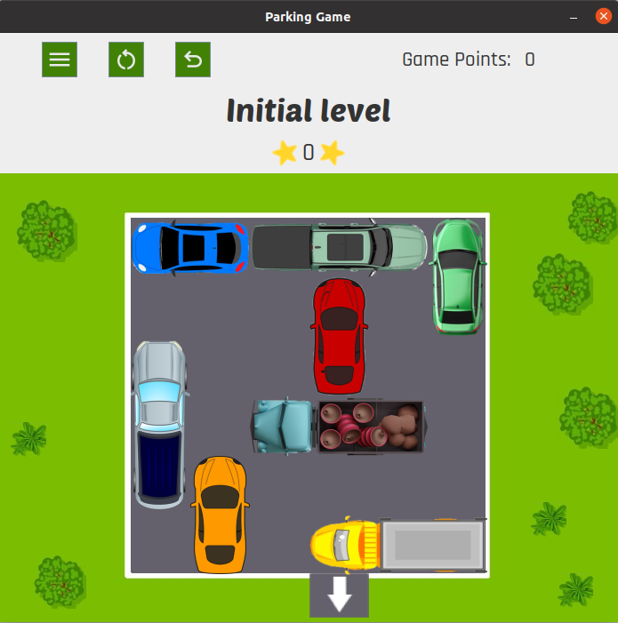

# **Parking Jam**

In this project, a video game called parking-jam has been developed. This video game consists of getting a red car to get out of a parking lot in which it is trapped by other vehicles.

## Table of Contents

* [Introduction](#introduction)
	* [Download project](#download-project)
	* [Run tests](#run-tests)
* [Project organization](#project-organization)
* [How to use](#how-to-use)
	* [Play](#play)
	* [Save and load games](#save-and-load-games)
* [Authors](#authors)

## Introduction ##
### Download project ###
#### Prerequisites ####
- [Java JDK](<https://www.oracle.com/java/technologies/javase-downloads.html>) (versión 8 o superior)
- [Maven](<https://maven.apache.org/install.html>) (versión 3.6.0 o superior)

#### Instructions ####
1. Clone the git repsitory:  `git clone https://costa.ls.fi.upm.es/gitlab/210241/parking-jam.git`

### Run tests ###
1. Go to the root directory of the repository inyour terminal
2. Create the project build `mvn clean install`
3. Run test:  `mvn test`

## Project organization ##

This project implements the model-controller-view pattern. This separation of concerns allows for more organized and modular code.

The Model represents the data and business logic, encapsulating the application's information and rules for manipulating that information. In this project contains the next classes:
- `Menu`, which represents the initial menu of the game.
- `Game` that represents a game with its different levels.
- `GameList` represents the list of the saved games.
- `Level` is the class that represents a level.
- `BoardReader` is the class in charge of processing the level files and check that they comply with the valid format.
- `Vehicle` represents the different vehicles in a level, including the red car.

The View is the presentation layer, responsible for displaying the data to the user and providing a means for user interaction. Contains: 
- `StartView` show the initial view.
- `GamesMenuView` represents the menu which show the open games and the option to load a saved game.
- `SavedGamesView` it will be shown the saved games which could be loaded.
- `LevelsMenuView` represents the menu which show the levels and theirs status in a game.
- `LevelView` that show a level to play it, the level and game points and some buttons with game functionalities .
- `EndGameView` it will appear when you finish all the levels of a game showing the final points and some options.
- `Factory` contains common methods used in different views.

Finally, the Controller acts as an intermediary between the Model and the View, processing user input from the View, updating the Model accordingly, and then updating the View to reflect any changes in the Model. This one contains only one class `Controller`, with all the necessary methods. 

These three folders are contained in `src/main/java/`. Additionally, the project has the folders: 
- `src/main/resources` that contains the icons, images, text fonts and level files for building the game.
- `src/main/gamesSaved` where the .txt files with the information of the saved games will be stored.
- `src/test/java` which contains the tests.

## How to use
To play you must be in the root directory of the repository. Subsequently, you must compile the project using the `mvn clean compile` command, and finally run it with the `mvn exec:java` command that will open a new window with the game initial view.

Here is the view of the first leve:

  

### Play
At the beginning you will have to create a new game and when you create it you will be able to access the levels of the game, which will be unlocked each time you manage to finish one. 

Once you pass a level you can try again to get a better score. At any time you can return to the level menu, the games menu, close the game or save the game by clicking on the buttons in the drop-down menu.

### Save and load games
To save the game you will only have to click on the 'save game' button in the drop-down menu, and when you want to load the saved game, in the games menu, when you click on the load game button, the saved games will be shown and you will be able to Choose the game you saved to continue playing where you left off.

When you save a game, a folder will be created in the directory indicated above. This will have the name of the saved game and will contain three files:
- one with the points of the past levels and the last unfinished one if there is one 
- another with the movement history of the unfinished level if there is one 
- and a last one with the status of the level unfinished if there is one, which will have the format of a level file

## Authors
- Sonia Gallego Trapero
- Lucas Coronel Naranjo
- Isabella Chaves Gómez
- Raúl López Soto

